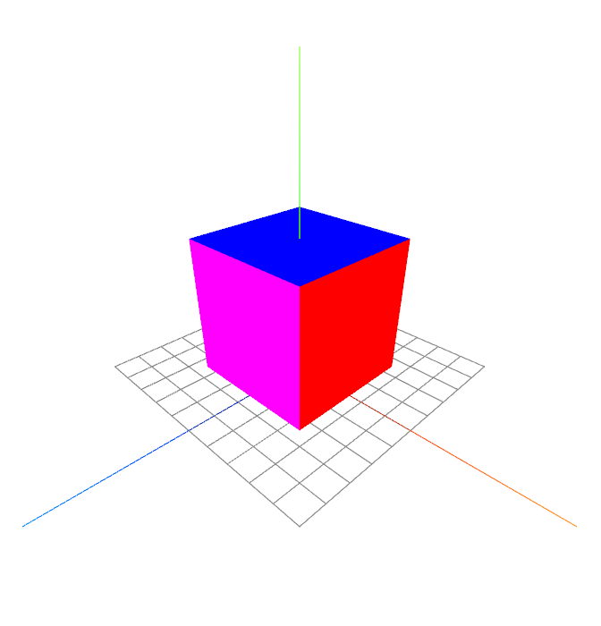

<h1 align="center"><b>three-vanilla</b></h1>

    

 
<h2>What is <b>three-vanilla</b>?</h2>
<b>three-vanilla</b> is a template three.js project with simple scene setup.

To run this project, open <b>server.exe</b> and in browser go to <b><a target="blank" href="http://localhost">localhost</a></b>
 

<b>three.js</b> version: 145

Creator: <b>Artur Brytkowski</b> 
 - <a target="_blank" href="https://www.fiverr.com/arturbrytkowski">Fiverr</a>
 - <a target="_blank" href="https://github.com/allala0">GitHub</a>
 
